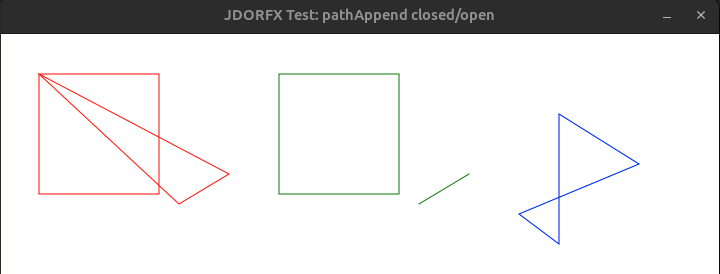
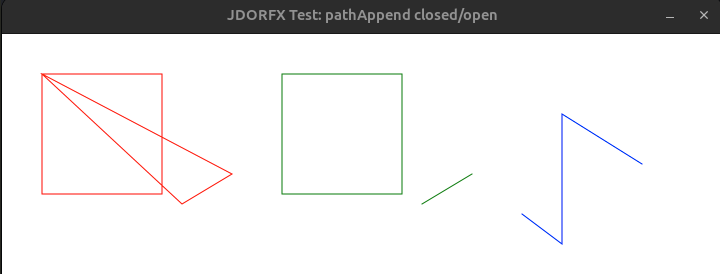

# JDORFX Fixes and Behavioral Differences

This document records implemented fixes and intentional behavioral differences
between JDOR and JDORFX. It is historical rationale, not a list of pending work.

## 1) `winFrame` — Änderung der Fensterdekoration nach `winShow`
- Problem: Aufruf von `winFrame .true|.false` nach Sichtbarmachen des Fensters führt zu IllegalArgumentException, da `Stage.initStyle(...)` nach `show()` nicht mehr erlaubt ist.
- Vorschlag / Fix: Bei Bedarf eine neue `Stage` mit gewünschter Dekoration erzeugen, aktuelle `Scene` und Fenster-Eigenschaften (Titel, Position, Resizable, alwaysOnTop) übernehmen, neue Stage anzeigen, alte Stage verbergen und die statische Referenz ersetzen.
- Dateien: `src/JavaFXDrawingHandler.java` (updater / `start(Stage)` / Stage-Management)
- Schritte zum Patch:
  1. Statische Referenz auf `Stage` sicherstellen (`primaryStage`).
  2. Im UI-updater bei Dekorationsänderung: falls Stage bereits gezeigt, neu erzeugen und Eigenschaften kopieren; ansonsten `initStyle` wie bisher verwenden.
  3. Tests: `./build.sh` + `./test.sh samples/<winFrame-sample>.rxj` — toggeln von `winFrame .true` / `.false` vor/nach `winShow`.
- Risiken: Fenster-Icons/Owner/Modality werden ggf. nicht automatisch kopiert; falls benötigt, erweitern.

## 2) `pathAppend` — Unterscheidung geschlossene vs offene Formen
- Problem: `pathAppend path shape true` schließt Pfade derzeit immer mit `ClosePath` unabhängig davon, ob die angehängte Form geschlossen ist.
- Vorschlag / Fix: Bestimmen, ob die angehängte Form eine geschlossene Form ist (`Rectangle`, `Ellipse`, `Polygon`, `Arc` mit Typ != OPEN etc.). Nur wenn `connect=.true` und die Form geschlossen ist, `ClosePath` hinzufügen.
- Dateien: `src/JavaFXDrawingHandler.java` (Methode/`case PATH_APPEND`)
- Schritte zum Patch:
  1. Während der Konvertierung eine `shapeClosed`-Variable führen.
  2. Setzen für bekannte geschlossene Formen.
  3. Am Ende `if (bConnect && shapeClosed) fxPath.getElements().add(new ClosePath());`.
  4. Tests: Skripte, die `pathAppend` mit geschlossenen und offenen Formen prüfen; visuelle Kontrolle und `pathCurrentPoint` Abfragen.
- Risiken: Edge-Cases bei komplexen zusammengesetzten Formen; dokumentieren und ggf. erweitern.

### Visual comparison

The original JDOR behavior is the compatibility target:

Before the fix, JDORFX forced both open and closed appended shapes to close:

After the fix, closed shapes may close while open shapes remain open, matching
JDOR:

The comparison is produced by `samples/test_bug3.rxj` and
`samples/test_bug3_fx.rxj`.

## 3) `Arc` → `Path` Konversion in `pathAppend`
- Problem: `Arc` enthält `startAngle`/`length`, `ArcTo` PathElement nicht; bisherige Heuristik benutzt `Shape.union()` und Index-Zugriffe, die fehleranfällig sind.
- Vorschlag / Fix: Robustere Extraktion: finde das erste `MoveTo` im erzeugten `Path` und hänge alle nachfolgenden `PathElement`s an; falls kein `MoveTo` gefunden wird, aussagekräftigen Fehler werfen.
- Dateien: `src/JavaFXDrawingHandler.java` (Abschnitt `if (fxShape instanceof Arc)`) 
- Schritte zum Patch:
  1. Erzeuge Dummy-`Path` via `Shape.union(emptyPath, arc)`.
  2. Suche erstes `MoveTo`-Element (Startpunkt).
  3. Füge `MoveTo`/`LineTo`/`ArcTo`/... ab diesem Index an.
  4. Tests: `pathAppend` mit `Arc`-Formen in `ArcType.OPEN` und anderen Typen; sicherstellen, dass Kurvenenden korrekt übernommen werden.
- Risiken: Manche Arc-Geometrien können in seltenen Fällen anders zerlegt werden; bei Bedarf mehr Tests und Fallback-Strategien.

---

Status: the fixes described above have been implemented and retained here for
regression testing and design context.

## 4) `winFrame` — rebuild Stage on decoration change and stop exception loop
- Problem: Calling `stage.initStyle(...)` on an already-shown `Stage` throws an exception; the updater retried the failing call repeatedly because the change flags were not cleared, flooding the JavaFX Application Thread with identical exceptions.
- Fix implemented: when a decoration change is requested while the `Stage` is visible, the handler now creates a new `Stage` with the requested decoration and swaps it in (rebuilds the stage). Additionally, the updater clears `changeFrame` and `changeScene` on failure so the failing path is not retried.
- File: `src/JavaFXDrawingHandler.java`
- Steps applied:
  1. Added a mutable `fxStage` field and a `rebuildStage(Stage, Scene)` helper that creates a new `Stage` with `initStyle(...)` set before showing.
  2. Updater now checks `changeFrame && changeDecoration && stage.isShowing()` and calls `rebuildStage(...)` to replace the shown stage atomically.
  3. The updater clears `changeFrame` and `changeScene` if the decoration update fails to avoid repeated rethrows.
  4. Verified with `./build.sh` and `./test.sh samples/test_bug1.rxj` (non-interactive run) — the repeated `WinFrame cannot be changed once the window has been set to visible` exception no longer appears in the logs.
- Tests: `./build.sh` then `printf '\n' | ./test.sh samples/test_bug1.rxj 2> log2.txt` — confirm the run completes and `log2.txt` contains no repeated exception traces.
- Risks: Rebuilding the `Stage` may require copying additional state (owner, icons, modality) if those features are used elsewhere; currently title, scene, visibility, size and close handler are preserved. If more properties are needed, extend the `rebuildStage` helper to copy them.

Status: Patch applied and tested locally; consider renaming/documenting `winFrame` vs `winVisible` to reduce confusion.
