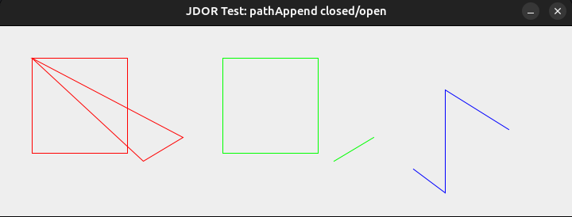

# JDORFX - Updates
This document summarizes the updates made to **JDORFX** to extend its capabilities, with a focus on the new animation subsystem, related 3D/shape improvements, and bug fixes.

## Overview
The main extension is the full incorporation of an Animation API into JDORFX. The goals were:
- Add animation commands and demonstrate using ooRexx samples.
- Integrate Timeline / KeyFrame support and common interpolators (including spline easing).
- Provide animations for 2D and 3D shapes.
- Fix known inconsistencies and shape/path handling bugs.

This update keeps the existing drawing API stable while adding animation and a small set of API/behavior fixes of documented issues.

## Animation Features
- New high-level animation commands added to the command enum:
    - `ANIMATION_FADE`
    - `ANIMATION_ROTATE`
    - `ANIMATION_FILL`
    - `ANIMATION_STROKE`
    - `ANIMATION_SCALE`
    - `ANIMATION_TRANSLATE`
    - `ANIMATION_PATH`
    - `ANIMATION_SEQUENTIAL`
    - `ANIMATION_PARALLEL`
    - `ANIMATION_PAUSE_TRANSITION`
    - `ANIMATION_SET_INTERPOLATOR`
    - `ANIMATION_PLAY`
    - `ANIMATION_PAUSE`
    - `ANIMATION_STOP`
    - `ANIMATION_STATUS`
- plus timeline primitives
    - `TIMELINE`
    - `KEYFRAME`
    - `KEYVALUE`.
- Timeline / KeyFrame support: create `TIMELINE` objects, compose `KEYFRAME`s with `KEYVALUE` entries and attach them to nodes, with configurable `duration`, `cycleCount`, and `autoReverse`.
- Interpolators: built-in linear and common easing interpolators and a `SPLINE(x1,y1,x2,y2)` option for custom easing curves.
- Composite animations: `ANIMATION_SEQUENTIAL` and `ANIMATION_PARALLEL` allow orchestration of multiple animations, but `ANIMATION_SET_INTERPOLATOR` applies only to supported transition animations, not to timelines or animation groups.
- Fill and stroke animation support is limited to 2D `Shape` instances; 3D nodes use the other animation types.

## Bug Fixes and Behavior Changes
- `winFrame`: fixed inconsistencies between JDOR and JDORFX window-framing and visibility behavior. The implementation now applies decoration changes by rebuilding the `Stage` (when already showing) and correctly resets internal change flags to avoid repeated exceptions.

    ```
    When a winFrame change requires switching between decorated and undecorated styles on a visible window, the updater runs rebuildStage(...) on the JavaFX Application Thread to create a new Stage with the requested StageStyle, reattach the Scene, preserve camera and visual state (by clearing and resetting them), hide the old stage and use the new one. All frame-change flags are cleared (including in error paths) so the handler does not repeatedly retry the failing operation.
    ```

- `pathAppend` consistency fix (`connect=true`):

    ```
    In JDOR, appending a closed shape (e.g., Rectangle, Ellipse) to a named path with connect=true may close the path to its start, while appending an open shape (e.g., Line, CubicCurve) does not force a closure. JDORFX previously closed paths for both shape categories whenever connect=true, which did not match JDOR behavior. The fix introduces a dedicated shape-type flag (open vs. closed) during append handling, so closure behavior now follows JDOR semantics exactly: conditional close for closed shapes, no forced close for open shapes.
    ```

**Comparison — pathAppend before / after**



*JDOR - replication goal; script: [test_bug3.rxj](../samples/test_bug3.rxj)*


*Before the fix — JDORFX forced closure for both open and closed shapes (incorrect).* 


*After the fix — JDORFX matches JDOR semantics: closed shapes may close, open shapes remain open. ; script: [test_bug3_fx.rxj](../samples/test_bug3_fx.rxj)*

- Arc-specific path handling: fixed the edge case where `pathAppend` on `Arc` shapes didn't behave like JDOR for cases of `connect=true` and closed arc (`ArchType.CHORD` & `ArcType.ROUND`).

    ```
    The old code tried to turn Arc into a Path by using Shape.union(), but union creates a closed geometric shape and does not preserve the original Arc path semantics reliably.

    The new code explicitly computes the start and end point from startAngle and length. Since ArcTo only needs the current path point and a target point, the path first moves/lines to the computed start point, then adds ArcTo to the computed end point. largeArcFlag is derived from abs(length) > 180. Because JavaFX screen coordinates invert the Y axis, sweepFlag must be inverted and is true only for negative arc lengths.

    For CHORD, the arc is closed directly with ClosePath. For ROUND/PIE, a line is added from the arc end to the center, then ClosePath closes back to the start point.
    ```
- Provide a depth-buffer option for Scene so 3D shapes clip correctly instead of visually overlaying each other.

    ```
    NEW_IMAGE allows passing a depthBuffer flag as its last argument (default: false).
    ```

## Samples
- New and updated samples demonstrating animation usage are included under the `samples/` folder. Refer to [samples](../samples) for runnable examples.
- Samples 01–12 contain foundational drawing and transformation examples; samples 13 and later demonstrate animation features and composed scenes. Files prefixed with `test_` are verification scripts that demonstrate and verify fixes for reported issues. These `test_` samples are partly also provided for JDOR for comparison, as JDORFX aims to align with JDOR.

## Implementation Notes and Docs
- Implementation details and rationale for Animation [04_ANIMATION_IMPLEMENTATION.md](04_ANIMATION_IMPLEMENTATION.md).
- Animation command reference: [jdorfx_animation_cmds_ref.txt](../src/jdorfx_animation_cmds_ref.txt).

## Compatibility
- Backwards compatibility: existing drawing commands and samples should continue to work unchanged.
- The added animation commands are additive and do not change the existing drawing command names.

## How to Try
After installing dependencies (Full JDK 8, ooRexx 5, BSF4ooRexx850) you can run the following scripts to run (see [02_setup_instructions.md](./02_setup_instructions.md)).

Linux (Ubuntu):

- Build (convenience script):
```bash
./build.sh
```

- Manual Java build steps (equivalent):
```bash

```

- Run a sample (script):
```bash
./test.sh samples/12a_jdorfx_fade_circle.rxj
```

- Run a sample (manual):
```bash

```

- Notes: `sudo` is required for copying into the system BSF4ooRexx directory; adjust `BSF4OOREXX_HOME` if your installation path differs.

Windows:
- Build (cmd):
```cmd

```

- Run a sample (cmd):
```cmd

```

For implementation details see [04_ANIMATION_IMPLEMENTATION.md](04_ANIMATION_IMPLEMENTATION.md) and the handler code at [src/JavaFXDrawingHandler.java](../src/JavaFXDrawingHandler.java).

---
Updated: 2026-06-01