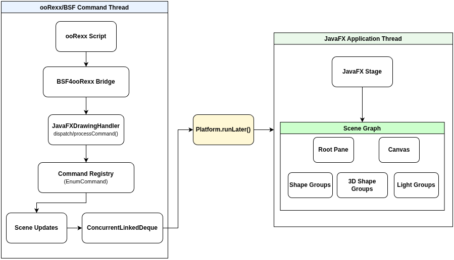

## JDORFX - Architecture
An ooRexx script issues comamnds to the JDORFX command environment, which are redirected through the BSF4ooRexx bridge to the `JavaFXDrawingHandler`, as the figure below shows. The handler processes each command via the `handleCommand()` and `processCommand()` methods and dispatches them through the command registry.

A `ConcurrentLinkedDeque` is used to collect the changes to the graphical state, to ensure thread-safe communication between the command-processing thread and the JavaFX Application Thread. GUI modifications are not performed directly form the **ooRexx/BSF command thread**, instead they are scheduled using `Platform.runLater()`, ensuring that all modifications to the JavaFX scene graph are executed on the **JavaFX Application Thread**.

The scene graph consists of a root pane containing a canvas for drawing operations as well as dedicated groups for 2D shapes, 3D shapes, and light sources. The scene graph is attached to the JavaFX stage, which represents the application's window.

### Architecture Diagram

